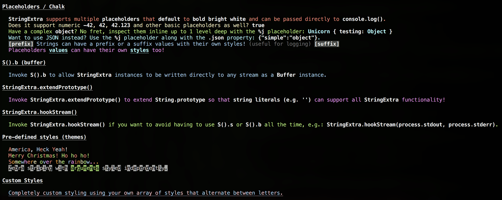

# string-extra

> [](https://travis-ci.org/unicorn-fail/string-extra)
>
> Extends [string.js] with extra functionality, like [chalk] and [sprintf] support.

## Usage

> It is recommended that you read the existing documentation for [string.js] first.

**Node.js:**
```js
const S = require('@unicorn-fail/string-extra').default;
```

**ES6/TypeScript:**
```js
import S from '@unicorn-fail/string-extra';
```

## Examples

`$ node examples.js` ([see file](examples.js)):



Methods
-------

See the [test file](test/test.js) or [TypeScript definition](index.d.ts) for more details.

`@todo - finish documenting new methods/properties`


License
-------

[Licensed under MIT](LICENSE)


[string.js]: https://github.com/jprichardson/string.js
[chalk]: https://github.com/chalk/chalk
[sprintf]: https://github.com/alexei/sprintf.js
