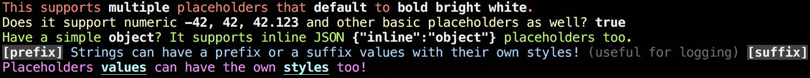

# string-extra

> [](https://travis-ci.org/unicorn-fail/string-extra)
>
> Extends [string.js] with extra functionality, like [chalk] and [sprintf] support.

## Usage

> It is recommended that you read the existing documentation for [string.js] first.

**Node.js:**
```js
const S = require('string-extra').default;
```

**ES6/TypeScript:**
```js
import S from 'string-extra';
```

## Examples

[examples.js](examples.js):
```js
console.log(S('This supports %s placeholders that %s to %s.', 'multiple', 'default', 'bold bright white').red.s);
console.log(S('Does it support numeric %d, %i, %.03f and other basic placeholders as well? %t', -42.123456789, 42.123456789, 42.123456789, true).yellow.s);
console.log(S('Have a simple %T? It supports inline JSON %j placeholders too.', obj, obj).green.s);
console.log(S('Strings can have a prefix or a suffix values with their own styles! %s', '(useful for logging)').blue.args.dim.prefix(S('[prefix]').bgBlack.whiteBright.bold).suffix(S('[suffix]').bgBlack.whiteBright.bold).s);
console.log(S('Placeholders %s can have the own %s too!', 'values', 'styles').magenta.args.cyanBright.bold.underline.s);
```

`$ node examples.js`:



Methods
-------

See the [test file](test/test.js) or [TypeScript definition](index.d.ts) for more details.

`@todo - finish documenting new methods/properties`


License
-------

[Licensed under MIT](LICENSE)


[string.js]: https://github.com/jprichardson/string.js
[chalk]: https://github.com/chalk/chalk
[sprintf]: https://github.com/alexei/sprintf.js
